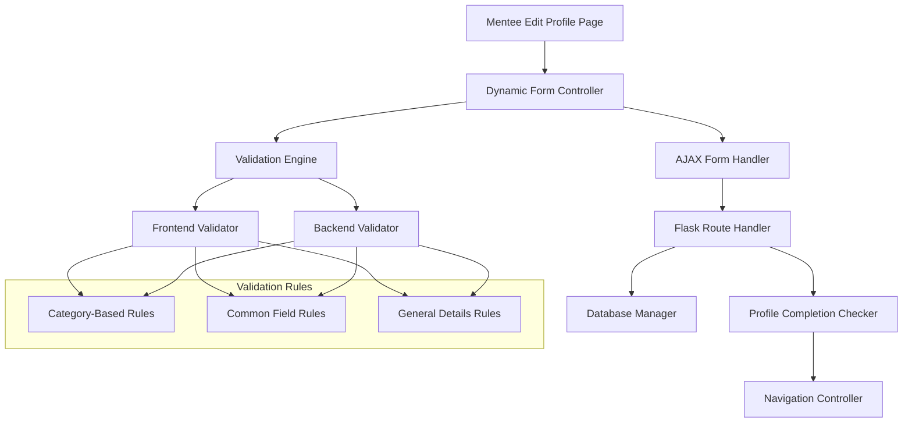

# Design Document

## Overview

This design addresses critical issues in the mentee profile management system by implementing dynamic field validation, AJAX form submission, improved navigation, and consistent data handling. The solution focuses on creating a seamless user experience where validation rules adapt to user selections and form submissions occur without page refreshes.

The core approach involves:
- Implementing conditional validation logic that changes based on "Who am I" selection
- Creating a unified validation system between frontend JavaScript and backend Flask
- Replacing traditional form submission with AJAX-based handling
- Updating profile completion checks to align with dynamic validation rules
- Enhancing navigation flow to prevent redirect loops

## Architecture

### Component Overview



### Data Flow

1. **Form Initialization**: Page loads with existing profile data and sets up dynamic field visibility
2. **Category Selection**: User selects "Who am I" category, triggering field visibility updates
3. **Validation**: Both frontend and backend use identical validation rules based on selected category
4. **Submission**: AJAX handler submits form data and processes server response
5. **Navigation**: Profile completion check determines next page destination

## Components and Interfaces

### 1. Dynamic Form Controller

**Purpose**: Manages field visibility and validation requirements based on user selections

**Key Methods**:
- `updateFormFields()`: Shows/hides sections based on "Who am I" selection
- `updateRequiredAttributes()`: Removes HTML5 required attributes from all fields
- `validateMenteeForm()`: Performs client-side validation using category-specific rules

**Interface**:
```javascript
class DynamicFormController {
    constructor(formElement, categorySelect);
    updateFormFields(category);
    updateRequiredAttributes();
    validateForm();
    getCategoryFields(category);
}
```

### 2. Validation Engine

**Purpose**: Provides consistent validation logic for both frontend and backend

**Validation Categories**:
- **school_student**: school_name, school_board
- **university_student**: institution_name
- **seeking_internship**: institution_name
- **young_professional**: current_role, industry, years_experience, current_organization
- **exploring**: last_role, restart_field, support_expected

**Common Fields** (all categories): mobile_number, whatsapp_number, mentorship_expectations

**General Details** (all categories): father_name, address_line1, city, state, postal_code, country

**Interface**:
```python
class ValidationEngine:
    def get_mandatory_fields(category: str) -> dict
    def validate_profile_data(data: dict, category: str) -> ValidationResult
    def get_missing_fields(data: dict, category: str) -> list
```

### 3. AJAX Form Handler

**Purpose**: Handles form submission without page refresh and manages server responses

**Key Features**:
- Prevents default form submission
- Displays loading states during submission
- Handles both success and error responses
- Manages client-side redirects after successful submission

**Interface**:
```javascript
class AjaxFormHandler {
    constructor(formElement, submitButton);
    submitForm(formData);
    handleSuccess(response);
    handleError(response);
    showMessage(message, type);
}
```

### 4. Profile Completion Checker

**Purpose**: Determines if a mentee profile is complete based on dynamic validation rules

**Updated Logic**:
- Checks only fields relevant to the selected "Who am I" category
- Includes General Details fields in completion check
- Handles cases where category selection changes after profile creation

**Interface**:
```python
def check_mentee_profile_complete(user_id: int) -> bool:
    profile = get_mentee_profile(user_id)
    if not profile or not profile.who_am_i:
        return False
    
    required_fields = get_mandatory_fields(profile.who_am_i)
    return all_fields_present(profile, required_fields)
```

## Data Models

### Updated MenteeProfile Model

The existing MenteeProfile model already contains the necessary fields. Key fields for validation:

**General Details Fields**:
- `father_name` (mandatory)
- `address_line1` (mandatory)
- `address_line2` (optional)
- `city` (mandatory)
- `state` (mandatory)
- `postal_code` (mandatory)
- `country` (mandatory)

**Category Selection**:
- `who_am_i` (mandatory for all)

**Common Fields**:
- `mobile_number` (mandatory for all)
- `whatsapp_number` (mandatory for all)
- `mentorship_expectations` (mandatory for all)
- `terms_agreement` (mandatory for all)
- `profile_picture` (mandatory for all)

**Category-Specific Fields**: Various fields used conditionally based on `who_am_i` value

### Age Calculation Helper

```python
def calculate_age(dob_string: str) -> str:
    """
    Calculate age from date of birth string.
    Returns: String like "22 years" or None if invalid
    """
    if not dob_string:
        return None
    
    try:
        dob = datetime.strptime(dob_string, '%Y-%m-%d').date()
        today = datetime.now().date()
        age = today.year - dob.year - ((today.month, today.day) < (dob.month, dob.day))
        return f"{age} years"
    except (ValueError, AttributeError):
        return None
```

Now I'll use the prework tool to analyze the acceptance criteria for correctness properties:

<function_calls>
<invoke name="prework">
<parameter name="featureName">mentee-profile-validation-fix